# Advanced Lane Finding
---

**a Udacity Self Driving Car Nano-Degree Project**

The goals / steps of this project are the following:

* Compute the camera calibration matrix and distortion coefficients given a set of chessboard images.
* Apply a distortion correction to raw images.
* Use color transforms, gradients, etc., to create a thresholded binary image.
* Apply a perspective transform to rectify binary image ("birds-eye view").
* Detect lane pixels and fit to find the lane boundary.
* Determine the curvature of the lane and vehicle position with respect to center.
* Warp the detected lane boundaries back onto the original image.
* Output visual display of the lane boundaries and numerical estimation of lane curvature and vehicle position.

## [Rubric](https://review.udacity.com/#!/rubrics/571/view) Points

### Here I will consider the rubric points individually and describe how I addressed each point in my implementation.  

---

### Camera Calibration

#### 1. Briefly state how you computed the camera matrix and distortion coefficients. Provide an example of a distortion corrected calibration image.

The code for this step is contained in the code cell (1, 2, 3) of the IPython notebook located in "Advanced_Lane_Finding.ipynb" 

I start by preparing "object points", which will be the (x, y, z) coordinates of the chessboard corners in the world. Here I am assuming the chessboard is fixed on the (x, y) plane at z=0, such that the object points are the same for each calibration image.  Thus, `objp` is just a replicated array of coordinates, and `objpoints` will be appended with a copy of it every time I successfully detect all chessboard corners in a test image.  `imgpoints` will be appended with the (x, y) pixel position of each of the corners in the image plane with each successful chessboard detection.  

I then used the output `objpoints` and `imgpoints` to compute the camera calibration and distortion coefficients using the `cv2.calibrateCamera()` function.  I applied this distortion correction to the test image using the `cv2.undistort()` function and obtained this result: 

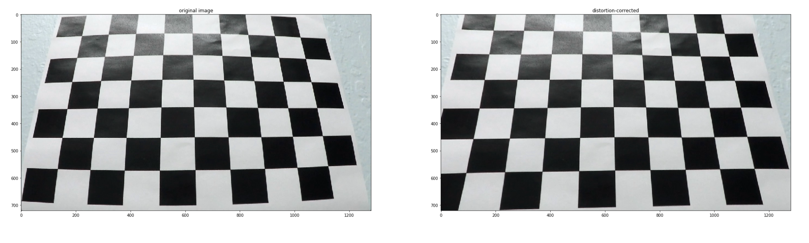

### Pipeline (single images)

#### 1. Provide an example of a distortion-corrected image.

To demonstrate this step, I will describe how I apply the distortion correction to one of the test images like this one:

a road image is loaded and distortion corrected. using below command.

`
undist = cv2.undistort(example_image, mtx, dist, None, mtx)
`


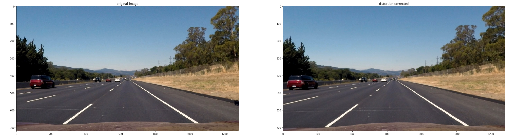

#### 2. Describe how (and identify where in your code) you used color transforms, gradients or other methods to create a thresholded binary image.  Provide an example of a binary image result.

I used a combination of color and gradient thresholds to generate a binary image (thresholding steps at lines # through # in `another_file.py`).  Here's an example of my output for this step.  (note: this is not actually from one of the test images)

First, I tried to use gradient to find lane lines, the result of eatch method is shown below. It looks good on normal images, but when the lighting condition or the road quality gets poor, too much noise came out, even if I use the S channel in HLS color space as input, it still cannot adopt well.

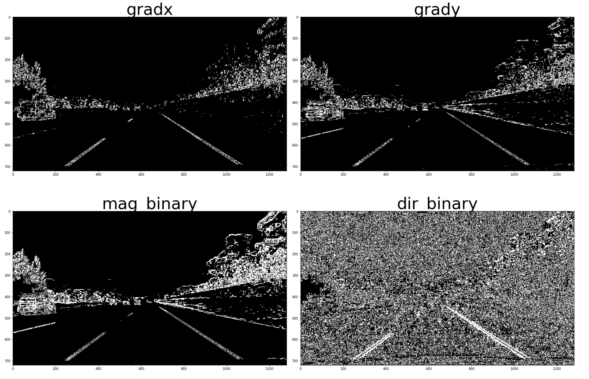
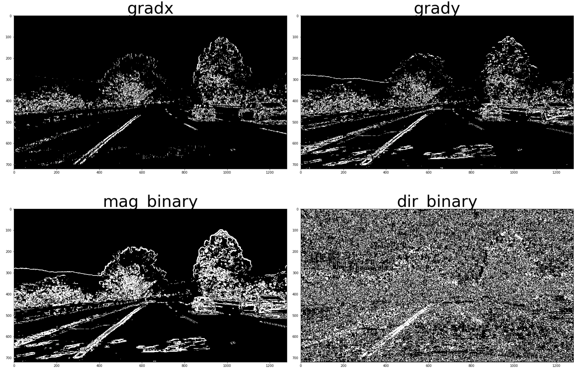

Later, in consideration of human visual, I think color is a key to detect lane lines as human, so I try to visualize different color spaces. the result is as follow:

I fond that in HLS color space, the S and H channel is good for detect yellow lane marks, while the L channel is good for find white lane marks, which is very difficult for gradient method.

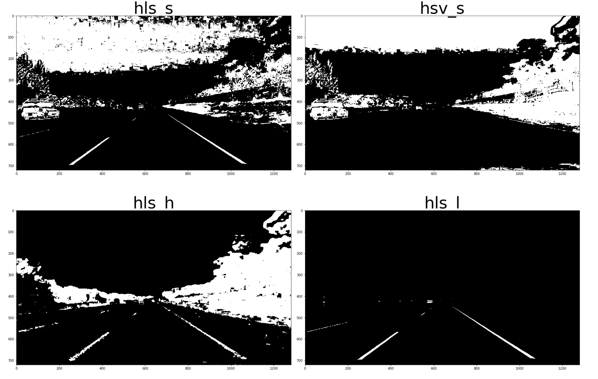
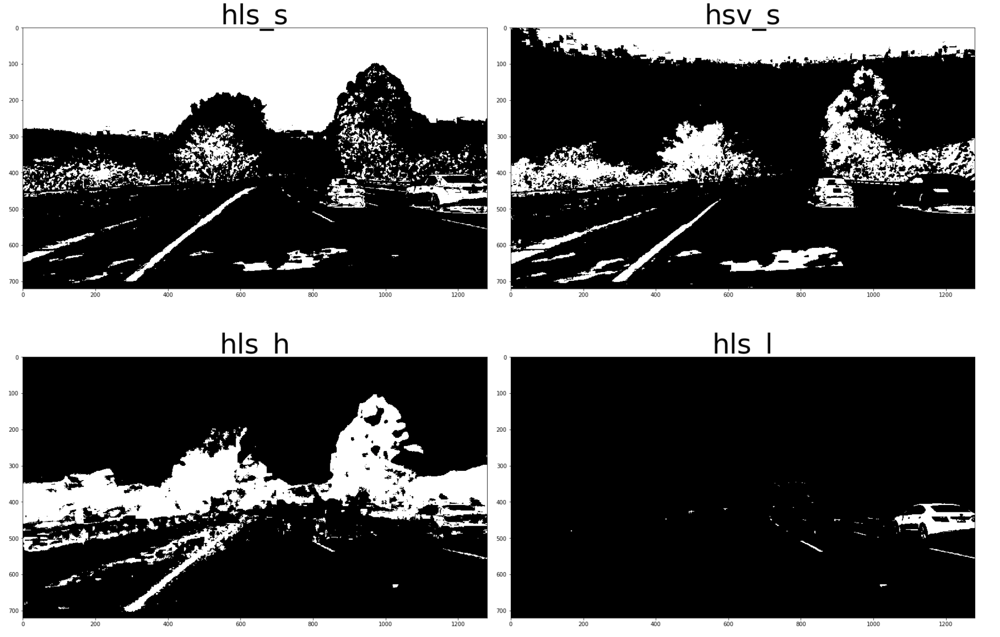

So I give up the fancy gradient method, just to stick on the color threshold method. For white color, I filtered out the high values in L channel, for yellow color, I used a combination of H and S channels thresholding, choosing the hue around 30, and high saturation pixels. The result is as below:

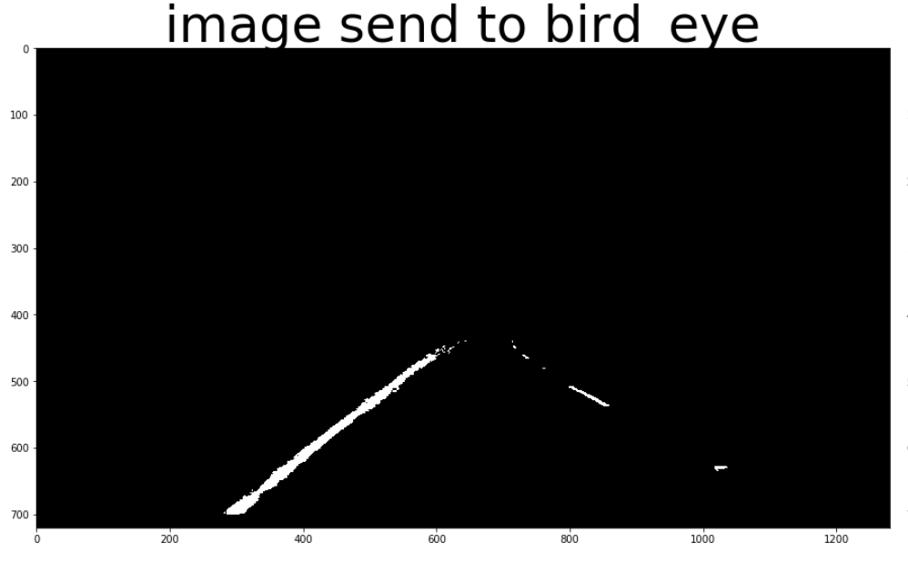

#### 3. Describe how (and identify where in your code) you performed a perspective transform and provide an example of a transformed image.

The code for my perspective transform functions are located in the 9th code cell of the Jupyter notebook. the `find matrix` function takes the `src` and `dst` points and returns the trasnformation matrix, I chose the hardcode the source and destination points in the following manner:

```python
src = np.float32([[586, 455],[699, 455],
                  [250, 691],[1076, 691]])
des = np.float32([[449.5, 200],[852.5, 200],
                  [449.5, 720],[852.5, 720]])
```

This resulted in the following source and destination points:

| Source        | Destination   | 
|:-------------:|:-------------:| 
| 585, 455      | 449.5, 200    | 
| 699, 455      | 852.5, 200    |
| 250, 691      | 449.5, 720    |
| 1076, 691     | 852.5, 720    |

I verified that my perspective transform was working as expected by drawing the `src` and `dst` points onto a test image and its warped counterpart to verify that the lines appear parallel in the warped image.

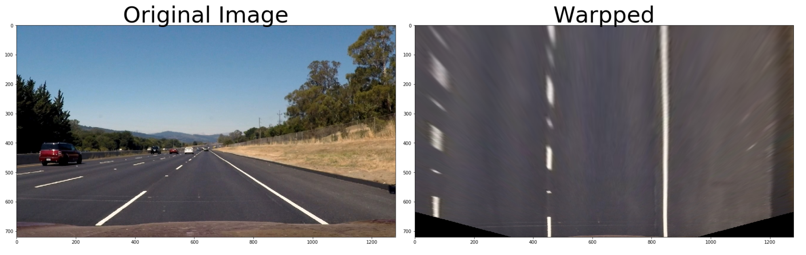

#### 4. Describe how (and identify where in your code) you identified lane-line pixels and fit their positions with a polynomial?

In the 11th code cell, I defined 2 functions `seperate_fit_first_time()` and `seperate_fit_with_reference` which are modified versions from udacity course examples, it will return `np.nan` if cannot find a lane line. `seperate_fit_first_time()` is to search the entire binary picture from scratch, start from the bottom half, using histogram to find the maximum pixels concentration position, use it as bottom position, then search up using a window around that position for 9 blocks, each block reference the previous block's maximum histogram point as middle point. `seperate_fit_with_reference` will use the previous fit polynomials as reference and search in a window around that polynomial. The work can be identified with below picture.

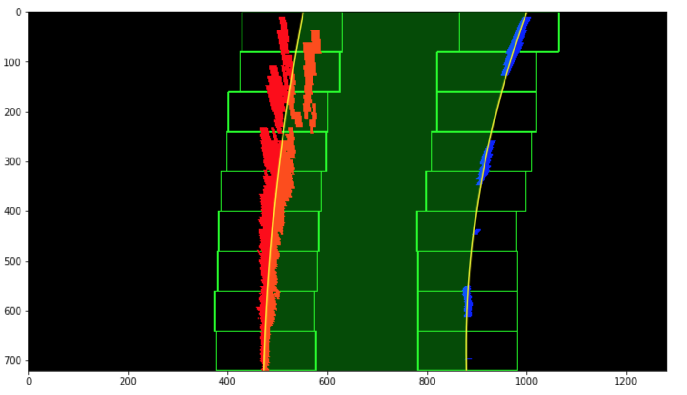
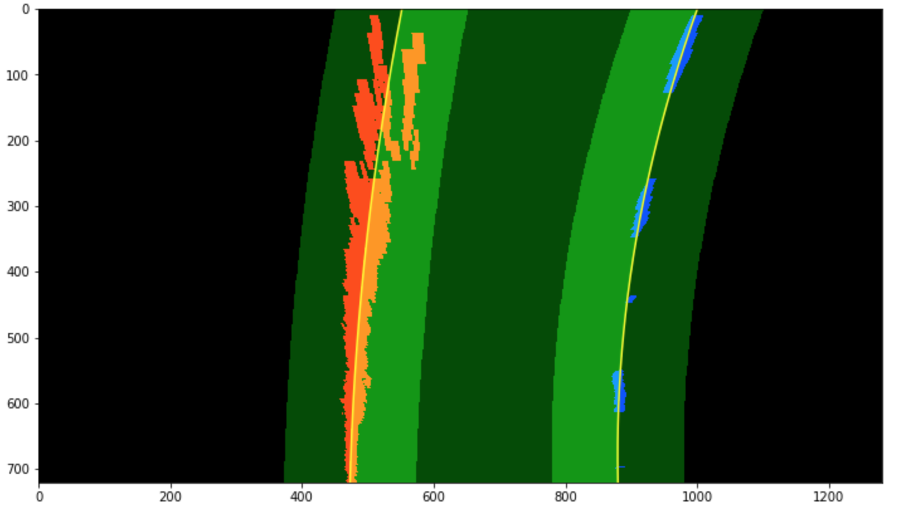

#### 5. Describe how (and identify where in your code) you calculated the radius of curvature of the lane and the position of the vehicle with respect to center.

The radius of curvature is calculated using `radius(left_fit, right_fit)` function located in the 13th code cell. It takes the polynomial fit as input and gives out radius of curvature as output.

#### 6. Provide an example image of your result plotted back down onto the road such that the lane area is identified clearly.

After the coloring the lane, it is warpped back and weight added to the original distortion corrected image, the final output image looks like below.

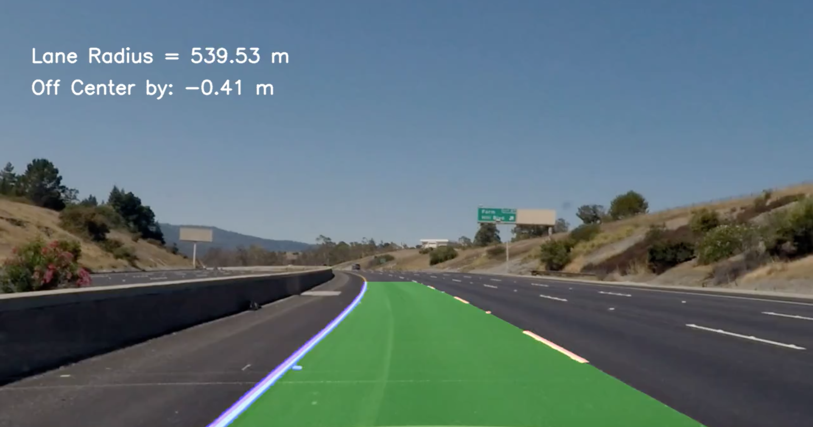

#### 7. Lane line filtering and averaging

In the code cell 15, I defined a `Line` class, it keeps track of all the polynomial fit detected and decide which line to keep and which to disregard. It also keeps track of other features like radius, line intersection with upper and lower boundaries, etc. The lines are judged if it is good or bad, then average recent `n` result to produce the final output, so that it is stable when encontering difficult images.

---

### Pipeline (video)

#### 1. Provide a link to your final video output.  Your pipeline should perform reasonably well on the entire project video (wobbly lines are ok but no catastrophic failures that would cause the car to drive off the road!).

Below are links to access my result.

[Online Streaming - **Youtube**](https://youtu.be/V2Er1_YNZTs)

[Download - **Github**](./output_videos/project_video_output.mp4)

[Download - **Aliyun.com**](http://udacitycarnd.oss-cn-shanghai.aliyuncs.com/github_link_file/advanced_lane_finding/project_video_output.mp4)

---

### Discussion

#### 1. Briefly discuss any problems / issues you faced in your implementation of this project.  Where will your pipeline likely fail?  What could you do to make it more robust?

At the begining, I wanted to use edges to find lanes, but it does not work well in complex content, the lighting and road conditions make the result really bad, so I had to swith use color thresholding. Tuning parameters is the hardest part, many approaches are tried before I could find a relatively good combination. But when I use it in the challenge video, it breaks a lot, I think if I want to get a good result in the challenge video, the picture feed into the pipe line needs a lot of pre-processing, eg. adjust the lighting, white balance, color intensity, in order to make the lanes bright and vivid. 

The real robust algorithm might need to check the detected element size and shape, to get an idea wether it is lane or a chunk of noise. At the same time, an adaptive thresholding could be a trick. It was also very hard to decide which combination of lane finding masks to use, an elaborately designed decision tree to automatically choose algorithm may be a good option, but the work load will be very tough.

